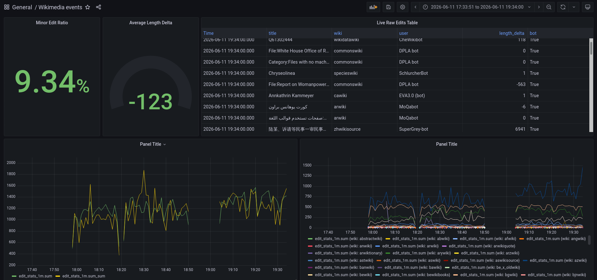

# Wikimedia Real-Time Edit Streaming Pipeline

A real-time data pipeline that ingests live Wikipedia edit events, processes them with Spark Structured Streaming, stores aggregates in InfluxDB, and visualizes them in Grafana.

```
Wikimedia SSE API
      │
      ▼
   Apache Flume          (exec source → Kafka sink)
      │
      ▼
  Apache Kafka           (topic: wikimedia)
      │
      ▼
 Apache Spark            (Structured Streaming)
      │
      ├──► InfluxDB  ──► Grafana   (raw page_edits + 1-min aggregates)
```

---

## Table of Contents

- [Overview](#overview)
- [Repository Structure](#repository-structure)
- [Prerequisites](#prerequisites)
- [Quick Start](#quick-start)
- [Component Details](#component-details)
- [InfluxDB Schema](#influxdb-schema)
- [Grafana Dashboards](#grafana-dashboards)
- [Configuration Reference](#configuration-reference)
- [Troubleshooting](#troubleshooting)

---

## Overview

The pipeline has four stages:

1. **Ingestion** — Apache Flume streams the [Wikimedia Recent Changes SSE feed](https://stream.wikimedia.org/v2/stream/recentchange) and publishes each event to a Kafka topic.
2. **Transport** — Apache Kafka decouples ingestion from processing and buffers events.
3. **Processing** — A PySpark Structured Streaming job parses the JSON events and writes two streams to InfluxDB:
   - `page_edits` — one point per raw edit event (append mode).
   - `edit_stats_1m` — 1-minute windowed aggregates per wiki and edit type (update mode).
4. **Visualization** — Grafana queries InfluxDB and renders live dashboards.

---

## Repository Structure

```
wikimedia-streaming/
├── flume/
│   └── api_to_kafka.conf          # Flume agent config (exec source → Kafka sink)
├── kafka/
│   └── create_topics.sh           # Creates the wikimedia Kafka topic
├── spark/
│   ├── wikimedia_spark.py         # PySpark Structured Streaming job
│   └── requirements.txt           # Python dependencies
├── grafana/
│   ├── datasource.yml             # InfluxDB datasource provisioning
│   └── dashboards/
│       └── wikimedia.json         # Exportable Grafana dashboard
├── .gitignore
├── LICENSE
└── README.md
```

---

## Prerequisites

All components are installed directly on the VM. Ensure the following are present before running the pipeline:

| Tool | Version tested | Notes |
|---|---|---|
| Java | 8 or 11 | Required by Kafka, Flume, and Spark |
| Apache Zookeeper | 3.x | Managed as a systemd service |
| Apache Kafka | 3.x | Managed as a systemd service |
| Apache Flume | 1.11.x | Kafka sink JAR must be on the Flume classpath |
| Apache Spark | 3.4.x | Installed standalone; uses `spark-sql-kafka` package at submit time |
| Python | 3.9+ | For the PySpark job |
| InfluxDB | 1.8.x | Uses the v1 HTTP API (`influxdb` Python client) |
| Grafana | 10.x | Managed as a systemd service |

---

## Quick Start

### 1. Clone the repository

```bash
git clone https://github.com/your-username/wikimedia-streaming.git
cd wikimedia-streaming
```

### 2. Start the required services

```bash
sudo systemctl start zookeeper
sudo systemctl start kafka
sudo systemctl start influxdb
sudo systemctl start grafana-server
```

Verify they are all running:

```bash
sudo systemctl status zookeeper kafka influxdb grafana-server
```

### 3. Create the Kafka topic

```bash
bash kafka/create_topics.sh
```

Or manually:

```bash
kafka-topics.sh --create \
  --bootstrap-server localhost:9092 \
  --topic wikimedia \
  --partitions 3 \
  --replication-factor 1
```

### 4. Start the Flume agent

```bash
flume-ng agent \
  --conf-file flume/api_to_kafka.conf \
  --name a1 \
  -Dflume.root.logger=INFO,console
```

Flume opens an `exec` source that runs `curl -sN https://stream.wikimedia.org/v2/stream/recentchange` and forwards each SSE line to the `wikimedia` Kafka topic.

### 5. Install Python dependencies

```bash
pip install -r spark/requirements.txt
```

### 6. Submit the Spark job

```bash
spark-submit \
  --packages org.apache.spark:spark-sql-kafka-0-10_2.12:3.4.0 \
  spark/wikimedia_spark.py
```

> Change the `_2.12:3.4.0` suffix to match your Spark and Scala versions.

### 7. Open Grafana

Navigate to [http://localhost:3000](http://localhost:3000) and import `grafana/dashboards/wikimedia.json`. The InfluxDB datasource is provisioned automatically via `grafana/datasource.yml`.

---

## Component Details

### Flume (`flume/api_to_kafka.conf`)

| Setting | Value | Description |
|---|---|---|
| Source type | `exec` | Runs a shell command and tails its stdout |
| Command | `curl -sN <SSE endpoint>` | Streams live Wikimedia events |
| Restart on failure | `true` / 5 s throttle | Reconnects automatically |
| Channel | `memory` (10 000 capacity) | In-process buffer |
| Sink type | `KafkaSink` | Writes to Kafka topic `wikimedia` |
| Batch size | 20 events | Tunable for throughput vs latency |

### Kafka

A single topic `wikimedia` is used. Increase `--partitions` if you want to run multiple Spark executors in parallel.

### Spark (`spark/wikimedia_spark.py`)

The job runs two concurrent streaming queries:

**Raw stream (`page_edits`)**
- Reads from Kafka, strips the `data: ` SSE prefix, and parses the JSON payload against a strict schema.
- Computes `length_delta = length.new − length.old`.
- Writes one InfluxDB point per event (append mode) via `foreachBatch`.

**Aggregated stream (`edit_stats_1m`)**
- Applies a 1-minute tumbling window with a 2-minute watermark.
- Groups by `(wiki, type)` and computes `edit_count`, `bot_edit_count`, `minor_edit_count`, `total_length_delta`, and `avg_length_delta`.
- Writes one InfluxDB point per window (update mode) via `foreachBatch`.

Checkpoints are written to `/tmp/spark_checkpoints/` to allow the job to resume after restart without reprocessing.

---

## InfluxDB Schema

**Database:** `wikimedia`

### Measurement: `page_edits`

| Field / Tag | Kind | Description |
|---|---|---|
| `wiki` | tag | Wiki identifier (e.g. `enwiki`) |
| `domain` | tag | Server domain |
| `server_name` | tag | Server name |
| `type` | tag | Edit type (`edit`, `new`, etc.) |
| `bot` | tag | `True` / `False` |
| `minor` | tag | `True` / `False` |
| `patrolled` | tag | `True` / `False` |
| `namespace` | tag | MediaWiki namespace integer |
| `id` | field | Event ID |
| `title` | field | Page title |
| `user` | field | Editor username |
| `comment` | field | Edit comment |
| `length_old` | field | Byte length before edit |
| `length_new` | field | Byte length after edit |
| `length_delta` | field | `length_new − length_old` |
| `revision_old` | field | Previous revision ID |
| `revision_new` | field | New revision ID |
| **time** | — | Unix nanosecond timestamp from event |

### Measurement: `edit_stats_1m`

| Field / Tag | Kind | Description |
|---|---|---|
| `wiki` | tag | Wiki identifier |
| `type` | tag | Edit type |
| `edit_count` | field | Total edits in window |
| `bot_edit_count` | field | Bot edits in window |
| `minor_edit_count` | field | Minor edits in window |
| `total_length_delta` | field | Net byte change in window |
| `avg_length_delta` | field | Average byte change per edit |
| **time** | — | Window start (nanoseconds) |

---

## Grafana Dashboards

The included dashboard (`grafana/dashboards/wikimedia.json`) provides:

- **Minor Edit Ratio** — stat panel showing the percentage of edits flagged as minor
- **Average Length Delta** — gauge showing the average byte change per edit
- **Live Raw Edits Table** — live scrolling table of raw edit events with title, wiki, user, length delta, and bot flag
- **Edits per minute (left chart)** — time-series of `edit_stats_1m` summed across all wikis
- **Edits per minute by wiki (right chart)** — time-series broken down per wiki



Import the JSON from Grafana → Dashboards → Import.

---

## Configuration Reference

All tunables are declared as constants at the top of `spark/wikimedia_spark.py`:

| Variable | Default | Description |
|---|---|---|
| `KAFKA_BOOTSTRAP` | `localhost:9092` | Kafka broker address |
| `KAFKA_TOPIC` | `wikimedia` | Kafka topic to consume |
| `INFLUX_HOST` | `localhost` | InfluxDB host |
| `INFLUX_PORT` | `8086` | InfluxDB port |
| `INFLUX_DB` | `wikimedia` | InfluxDB database name |
| `TRIGGER_INTERVAL` | `10 seconds` | Spark micro-batch interval |
| `CHECKPOINT_RAW` | `/tmp/spark_checkpoints/wikimedia_raw` | Raw stream checkpoint |
| `CHECKPOINT_AGG` | `/tmp/spark_checkpoints/wikimedia_agg` | Aggregate stream checkpoint |

---

## Troubleshooting

**Flume: `Connection refused` to Kafka**
Make sure Kafka is running and `kafka.bootstrap.servers` in the Flume config matches your broker address.

**Spark: `failOnDataLoss` warnings**
Normal when starting from `earliest` and older offsets have been cleaned up. The job will continue with available offsets.

**InfluxDB: no data appearing**
Check that the `wikimedia` database was created. The Spark job creates it automatically on startup, but you can also create it manually:
```bash
curl -XPOST http://localhost:8086/query --data-urlencode "q=CREATE DATABASE wikimedia"
```

**Spark checkpoint conflicts after schema change**
Delete the checkpoint directories and restart the job:
```bash
rm -rf /tmp/spark_checkpoints/wikimedia_raw /tmp/spark_checkpoints/wikimedia_agg
```

**SSE events not parsed (all `json_str` empty)**
Verify the raw Kafka messages actually contain the `data: ` prefix:
```bash
kafka-console-consumer.sh --bootstrap-server localhost:9092 --topic wikimedia --max-messages 5
```
